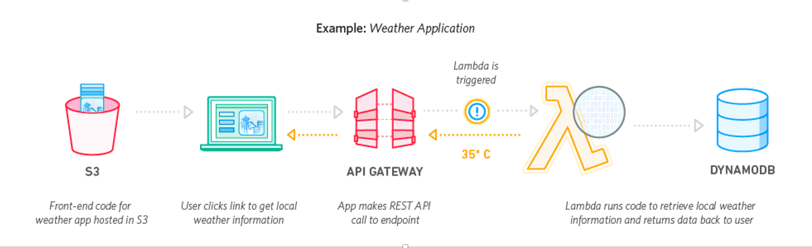

# Key Concepts
This section will cover the key concepts we're going to be referencing throughout the workshop.

- [Cloud computing & AWS](#what-is-cloud-computing-and-aws)
    - API gateway
    - Lambda
    - Cloudwatch
    - SNS
    - SQS
- [Event driven architecture](#what-is-event-driven-architecture)
- [Serverless](#what-is-serverless)

 

***
## What is cloud computing and AWS
***
>Cloud computing is the delivery of on-demand computing services -- from applications to storage and processing power -- typically over the internet and on a pay-as-you-go basis. 
>
>Rather than owning their own computing infrastructure or data centers, companies can rent access to anything from applications to storage from a cloud service provider.
>
>One benefit of using cloud computing services is that firms can avoid the upfront cost and complexity of owning and maintaining their own IT infrastructure, and instead simply pay for what they use, when they use it.
[Reference](https://www.zdnet.com/article/what-is-cloud-computing-everything-you-need-to-know-about-the-cloud/).

 

There's heaps of cloud technology providers out there and `AWS` is just one of them. Other products include: Google Cloud Platform, Microsoft Azure, Alibaba Cloud and many more.

 

Services AWS offers that we will be using this workshop are: 
- [API gateway](https://aws.amazon.com/api-gateway/)
- [Lambda](https://aws.amazon.com/lambda/)
- [Cloudwatch](https://aws.amazon.com/cloudwatch/)
- [SNS](https://aws.amazon.com/sns/)

***
## What is event driven architecture
***

Event-driven architecture is a software architecture pattern promoting the production, detection, consumption of, and reaction to events (reference Wikipedia). And it's what we'll be doing in this workshop! 

<b>Example:</b>\
Event = User clicks on link\
Function = Retrieve requested information

 

***
## What is serverless
***

>"The Serverless Framework is an open-source CLI for building and deploying serverless applications."
>
>https://serverless.com/framework/

You can use infrastructure as code to deploy a serverless application and it’s supporting resources via the Command Line.
In the context of AWS, you can use the Serverless Framework to deploy a Lambda function and it’s associated resources.
Use cases include any functions you might use Lambda.
There’s loads of examples at https://serverless.com/examples/

 
 

# [NEXT SECTION - Overview 👉🏽](../03-project-work/03.1-diagram/03.1-overview.md)