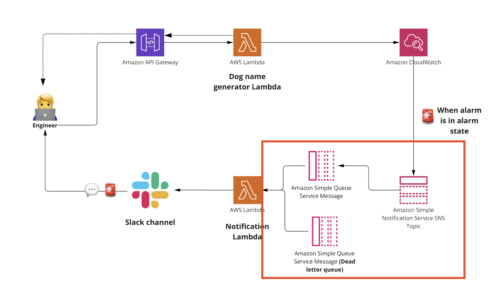

# SNS Topic

An SNS Topic is more like a communication channel. It follows a PubSub (Publisher-Subscriber) model. Where a particular service publishes messages to an SNS topic and a replica of that message is sent to all the services subscribing to that topic like Email, HTTP Endpoint (NodeJS app etc.), SQS, Texting. AWS SNS is always a one (SNS Topic) to many relationship.

The `AWS::SNS::Topic` resource creates a topic to which notifications can be published.




# SQS Queue and Dead Letter Queue

An SQS queue is a temporary repository for messages that are awaiting processing. Using Amazon SQS, you can decouple the components of a cloud application by transmitting any volume of data, at any level of throughput, without losing messages or requiring other services to be available.

A dead-letter queue is a queue that other (source) queues can target for messages that can't be processed (consumed) successfully. You can set aside and isolate these messages in the dead-letter queue to determine why their processing didn't succeed.

## How is it used with SNS?

When you subscribe an SQS queue to an SNS topic, you can publish a message to the topic and Amazon SNS sends the message to the subscribed queue. The message is then stored in the queue and can be processed by the consumer.

Benefits of using SQS with SNS:
- **Decoupling**: The SNS topic can publish messages to multiple SQS queues, which can then be processed independently.
- **Scalability**: SQS can handle a high volume of messages per second, which can help you scale your application.
- **Reliability**: If the consumer of the message is down, the message is stored in the queue and can be processed later.
- **Error Handling**: If the consumer of the message fails to process the message, the message can be sent to a dead-letter queue for further analysis.

# Create a SQS Queue
The below code is the minimal code to create an SQS queue. The `QueueName` is an optional property as AWS CloudFormation will generate a unique physical ID and uses that ID for the queue name, but in this case we'll define the queue name so we could reference it in the next resource we're creating. 

We'll also create a dead-letter queue for the SQS queue. This will allow us to isolate messages that can't be processed successfully.

```
resources: # CloudFormation template syntax
  Resources:
    <QueueName>:
      Type: AWS::SQS::Queue
      Properties: 
        QueueName: <QueueName>
        RedrivePolicy:
          deadLetterTargetArn:
            Fn::GetAtt: [<DeadLetterQueueName>, Arn]
          maxReceiveCount: 1
    <DeadLetterQueueName>: 
      Type: AWS::SQS::Queue
      Properties: 
        QueueName: <DeadLetterQueueName>
```

# Create a SNS Topic
The below code is the minimal code to create an SNS topic. The `TopicName` is an optional property as AWS CloudFormation will generate a unique physical ID and uses that ID for the topic name, but in this case we'll define the topic name so we could reference it in the next resource we're creating.

We'll also subscribe the SQS queue to the SNS topic. This will allow the SNS topic to publish messages to the SQS queue.

```
resources: # CloudFormation template syntax
  Resources:
    ...
    <SNSName>:
      Type: AWS::SNS::Topic
      Properties: 
        TopicName: <TopicName>
        Subscription:
          -
            Endpoint:
              Fn::GetAtt: [<QueueName>, Arn]
            Protocol: sqs
```
</br>
</br>

# [NEXT SECTION - Alarm setup 👉🏽](../03.5-alarm-setup/03.5-alarm-setup.md)
