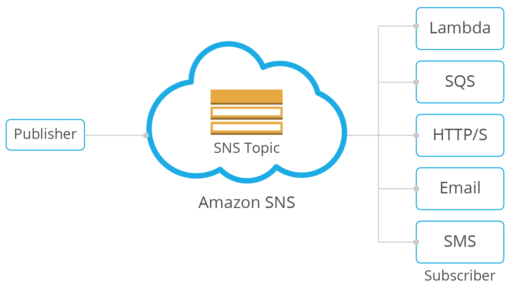

# SNS Topic

An SNS Topic is more like a communication channel. It follows a PubSub (Publisher-Subscriber) model. Where a particular service publishes messages to an SNS topic and a replica of that message is sent to all the services subscribing to that topic like Email, HTTP Endpoint (NodeJS app etc.), SQS, Texting. AWS SNS is always a one (SNS Topic) to many relationship.

The `AWS::SNS::Topic` resource creates a topic to which notifications can be published.




# Create a SNS Topic
The below code is the minimal code to create an SNS topic. The `TopicName` is an optional property as AWS CloudFormation will generate a unique physical ID and uses that ID for the topic name, but in this case we'll define the topic name so we could reference it in the next resource we're creating.

Define SNS as aws resources in a property titled `resources`. We will write raw CloudFormation template syntax, in YAML:

```
resources: # CloudFormation template syntax
  Resources:
    <SNSName>:
      Type: AWS::SNS::Topic
      Properties: 
        TopicName: <TopicName>
```
</br>
</br>

# [NEXT SECTION - Alarm setup 👉🏽](../03.5-alarm-setup/03.5-alarm-setup.md)
