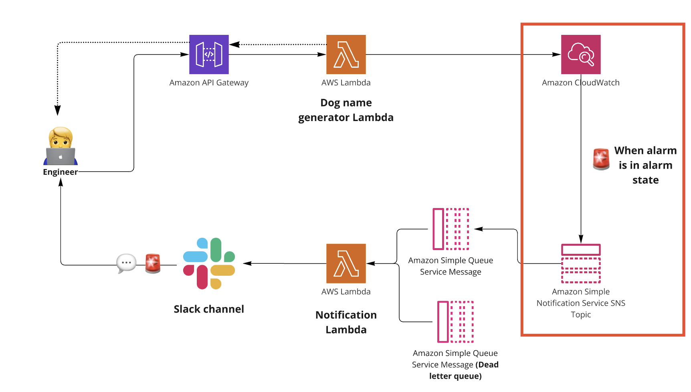

# Cloudwatch Alarms

Amazon CloudWatch monitors your Amazon Web Services (AWS) resources and the applications you run on AWS in real time. You can use CloudWatch to collect and track metrics, which are variables you can measure for your resources and applications. [More here...](https://docs.aws.amazon.com/AmazonCloudWatch/latest/monitoring/WhatIsCloudWatch.html)



# Create an alarm
We'll be setting up a metric alarm based on the response the endpoint returns to the user. In this case we only want to be notified when there are 500 errors. The alarm action that we'll set for when it changes from `OK` to `ALARM` state will be sending a message to the SNS Topic we created earlier. 

```
    <AlarmName>:
      Type: AWS::CloudWatch::Alarm
      Properties:
        AlarmName: '${self:service}-${self:provider.stage}-<AlarmName>'
        AlarmDescription: Get generated dog name lambda alarm
        Namespace: AWS/ApiGateway
        MetricName: 5XXError
        Dimensions:
          - Name: ApiName
            Value: ${self:provider.stage}-${self:service}
        Statistic: Sum
        ComparisonOperator: GreaterThanThreshold
        Threshold: 0
        Period: 60
        EvaluationPeriods: 1
        AlarmActions:
          - Ref: <SNSName>
```

# Result
Now deploy the cloudformation stack to checkout these results.

## SNS Topic Deployed


## Cloudwatch Alarm Deployed


## Cloudwatch Alarm in Alarm State
Enter a wrong breed name and do a call `curl -X GET -H "Authorization: AWS $awsAccessKey:$awsSecretKey" "https://439y2x4cy8.execute-api.ap-southeast-2.amazonaws.com/dev/generate/wrongbreed/name"` and it should invoke the alarm state.


</br>
</br>

# [NEXT SECTION - Create slack app 👉🏽](../03.6-create-slack-app/0.3.6-create-slack-app.md)
